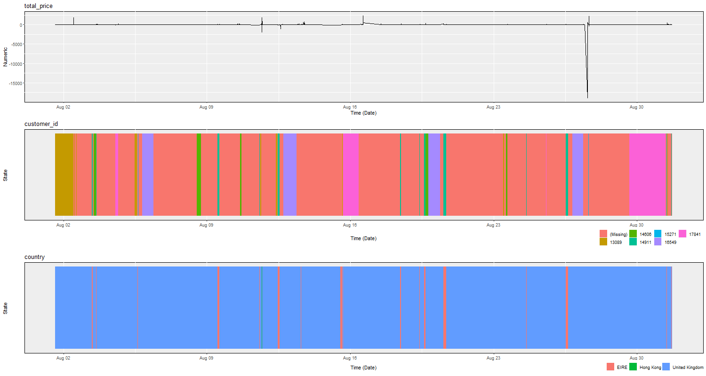

```{r setup, include=FALSE}
knitr::opts_chunk$set(echo = TRUE)
```

```{r, include = FALSE}
library(tidyverse)
library(Hmisc)
library(ggplot2)
library(dplyr)
library(tidyr)
library(janitor)
library(plotly)
library(TSstudio)
library(data.table)
library(lubridate)
library(highcharter)
library(purrr)
library(grid)

library(cluster)
library(readr)
library(Rtsne)
library(TTR)
library(xts)

library(timelineR)

require(smooth)

library(DataExplorer)
```


## Introduction of *http://archive.ics.uci.edu/ml/machine-learning-databases/00502/* dataset.

Transactions occurring for a UK-based and registered, non-store online retail between 01/12/2009 and 09/12/2010.

Changing format for a more lightweight solution.

```{r}
#data <- readxl::read_xlsx("../online_retail_II.xlsx")

#saveRDS(data, file = "online_retail_II.rds")

```

Reading data.

```{r, include = FALSE}
data <- readRDS("online_retail_II.rds")
```

```{r}
colnames(data)
```

InvoiceNo: Invoice number. Nominal. A 6-digit integral number uniquely assigned to each transaction. If this code starts with the letter 'c', it indicates a cancellation.

StockCode: Product (item) code. Nominal. A 5-digit integral number uniquely assigned to each distinct product.

Description: Product (item) name. Nominal.

Quantity: The quantities of each product (item) per transaction. Numeric.

InvoiceDate: Invoice date and time. Numeric. The day and time when a transaction was generated.

UnitPrice: Unit price. Numeric. Product price per unit in sterling (£).

CustomerID: Customer number. Nominal. A 5-digit integral number uniquely assigned to each customer.

Country: Country name. Nominal. The name of the country where a customer resides.

```{r}
# some basic cleaning and factoring these columns for easier visualization of ratios
data <- data %>% clean_names()
data$description <- as.factor(data$description)
data$description <- fct_explicit_na(data$description)
data$country <- as.factor(data$country)
data$customer_id <- fct_explicit_na(as.factor(data$customer_id))
data$stock_code <- fct_explicit_na(as.factor(data$stock_code))


summary(data)
tail(data)
str(data)

#data explorer report
#DataExplorer::create_report(data)

```

```{r}
#here we notice that quantity can be negative. this indicates it should be a good idea to create a total price value that multiplies qty * price
data %>% filter(startsWith(invoice,"C")) %>% filter(stock_code == "22087")


data <- data %>% mutate(total_price = quantity * price)
```

## Comparing daily turnover of online retailer platform in 2009 and 2010 December.

What we can see here is that:
- in December 2009, there were sales up until the 23rd of December
- in December 2010 sales were made only until the 9th of December. It suggests there might be missing data from the last days of 2010
- We can also deduce that this online retail stops working from Christmas until January.

```{r, echo = FALSE}
# filters for only december
decembercomparison2009 <- data %>% filter(month(invoice_date) == 12 & (year(invoice_date) %in% c(2009))) %>% mutate(day = lubridate::day(invoice_date), year = year(invoice_date)) %>% group_by(day, year) %>% summarise(daily_sales=sum(total_price)) %>% ungroup()

decembercomparison2009 <- add_row(decembercomparison2009, day = 24:31, year = 2009, daily_sales = 0)

decembercomparison2010 <- data %>% filter(month(invoice_date) == 12 & (year(invoice_date) %in% c(2010))) %>% mutate(day = lubridate::day(invoice_date), year = year(invoice_date)) %>% group_by(day, year) %>% summarise(daily_sales=sum(total_price)) %>% ungroup()

decembercomparison2010 <- add_row(decembercomparison2010, day = 10:31, year = 2010, daily_sales = 0)

decembercomparison2009 <- decembercomparison2009 %>% mutate( date = as.Date(ymd(paste0(year, "-12-", day)))) %>% select(daily_sales, date)
decembercomparison2010 <- decembercomparison2010 %>% mutate( date = as.Date(ymd(paste0(year, "-12-", day)))) %>% select(daily_sales, date)
```


```{r}
ts_plot(decembercomparison2009, Ytitle = "Total Sales", line.mode = "lines+markers")
```

```{r}
ts_plot(decembercomparison2010, Ytitle = "Total Sales", line.mode = "lines+markers")
```

## Visualizing distribution of daily purchases

Here we see the amount of different items per invoice per day for December 2009. 

```{r}
fntltp <- JS("function(){
  return this.point.x + ' ' +  this.series.yAxis.categories[this.point.y] + ':<br>' +
  Highcharts.numberFormat(this.point.value, 2);
}")


data %>% filter(month(invoice_date) == 12 & (year(invoice_date) %in% c(2009))) %>% mutate(day = lubridate::day(invoice_date), year = year(invoice_date)) %>% group_by(invoice, as.factor(day)) %>% mutate(sales_per_invoice = sum(total_price))%>% ungroup() %>% group_by(day) %>% count(invoice) %>% arrange(day, -n) %>% ungroup() %>% hchart("heatmap", hcaes(x = day, y = invoice, value = n)) %>% 
  hc_yAxis(reversed = TRUE, offset = -20, tickLength = 0,
           gridLineWidth = 0, minorGridLineWidth = 0,
           labels = list(style = list(fontSize = "8px"))) %>%  
  hc_tooltip(formatter = fntltp) %>% 
  hc_size(height = 1000)

```

## Here we see the amount of different items per invoice per day for December 2010.

```{r}
data %>% filter(month(invoice_date) == 12 & (year(invoice_date) %in% c(2010))) %>% mutate(day = lubridate::day(invoice_date), year = year(invoice_date)) %>% group_by(invoice, as.factor(day)) %>% mutate(sales_per_invoice = sum(total_price))%>% ungroup() %>% group_by(day) %>% count(invoice) %>% arrange(day, -n) %>% ungroup() %>% hchart("heatmap", hcaes(x = day, y = invoice, value = n)) %>% 
  hc_yAxis(reversed = TRUE, offset = -20, tickLength = 0,
           gridLineWidth = 0, minorGridLineWidth = 0,
           labels = list(style = list(fontSize = "8px"))) %>%  
  hc_tooltip(formatter = fntltp) %>% 
  hc_size(height = 1000)

```

## Top 20 favorite profit maker friends for both December's (2009 and 2010).

```{r}
data %>% filter(month(invoice_date) == 12 & (year(invoice_date) %in% c(2009, 2010))) %>% mutate(day = lubridate::day(invoice_date), year = year(invoice_date)) %>% group_by(customer_id, as.factor(day), year) %>% summarise(sales_per_invoice = sum(total_price)) %>% ungroup() %>% arrange(-sales_per_invoice) %>% head(20)
```

## Top 10 selling items in the two years' Decembers.

```{r}
data %>% filter(month(invoice_date) == 12 & (year(invoice_date) %in% c(2009, 2010))) %>% mutate(day = lubridate::day(invoice_date), year = year(invoice_date)) %>% group_by(invoice, as.factor(day)) %>% mutate(sales_per_invoice = sum(total_price)) %>% ungroup() %>% count(description) %>% arrange(-n) %>% head(10) %>%
  hchart(type = "bar", hcaes(x = description, y = n))

```

## Top 20 selling items in the whole dataset.

```{r}
head(summary(data$description), 20)
```

## Customer concentration

Most similar clients:

```{r}
#' Compute Gower distance in december 2010 data because it's time consuming
concentrationdf <- data %>% group_by(customer_id, country) %>% filter(month(invoice_date) == 12 & (year(invoice_date) %in% c(2010))) %>% select(-invoice_date, -price, -quantity) %>% summarise(sum_total_price = sum(total_price))
#concentrationdf$invoice <- as.factor(concentrationdf$invoice) 
gower_dist <- daisy(concentrationdf, metric = "gower")

gower_mat <- as.matrix(gower_dist)
#' Print most similar clients
concentrationdf[which(gower_mat == min(gower_mat[gower_mat != min(gower_mat)]), arr.ind = TRUE)[1, ], ]
```

Most dissimilar clients:

```{r}
#' Print most dissimilar clients
concentrationdf[which(gower_mat == max(gower_mat[gower_mat != max(gower_mat)]), arr.ind = TRUE)[1, ], ]

sil_width <- c(NA)
for(i in 2:15){
  pam_fit <- pam(gower_dist, diss = TRUE, k = i)
  sil_width[i] <- pam_fit$silinfo$avg.width
}

plot(1:15, sil_width,
     xlab = "Number of clusters",
     ylab = "Silhouette Width") +
lines(1:15, sil_width)
```

Here we can see the results of the clusterisation:

```{r}
k <- 10

pam_fit <- pam(gower_dist, diss = TRUE, k)


tsne_obj <- Rtsne(gower_dist, is_distance = TRUE)
tsne_data <- tsne_obj$Y %>%
  data.frame() %>%
  setNames(c("X", "Y")) %>%
  mutate(cluster = factor(pam_fit$clustering))
ggplot(aes(x = X, y = Y), data = tsne_data) +
  geom_point(aes(color = cluster))

```

Used Gower distance to find similar customers and found a pattern in one group. The rest of the 9. It needs more tuning since variables were left behind due to hard drive size limitations.

## Amount of different item orders by country

We have entries from 40 different countries.

```{r}
countryfreq <- summary(data$country)
countries <- stack(countryfreq)

countries %>% rename(country = ind, n = values) %>% arrange(-n)
```

## Shopping dynamics of a particular day: 14th of November 2010

```{r}
dynamics <- data %>% filter(day(invoice_date) == 14 & month(invoice_date) == 11 & (year(invoice_date) %in% c(2010))) %>% select(-quantity)

#lags
dyna_tl <- mutate( dynamics, total_price = lag( total_price ) )
dyna_all <- bind_rows( old = dynamics, new = dyna_tl, .id="source" ) %>%
    arrange( invoice_date, source) 

ggplot(dynamics, aes(invoice_date, total_price)) +
  geom_step() +
  geom_ribbon( data = dyna_all, aes( ymin = 0, ymax = total_price ),
             fill="tomato", alpha=0.5 )

```

## Customer loyalty in August 2010

This can be reproduced in a bigger scale by increasing the amount of minimum interactions of a customer with the store.

```{r}


loyaltysubset <- data %>% filter(month(invoice_date) == 8 & (year(invoice_date) %in% c(2010))) %>% select(-stock_code, -description, -invoice, -quantity, -price)

#remove unimportant clients
tt <- table(loyaltysubset$customer_id)
rare_levels <- names(tt)[tt<200]
loyaltysubset <- subset(loyaltysubset,!customer_id %in% rare_levels)


summary(loyaltysubset)
plot_timeline <- plot_timeline(loyaltysubset, save_path = "loyalty.png")
grid.draw(plot_timeline, recording=TRUE)
```




## Predicting daily sales in January 2010 x day ahead forecasts.

```{r}
jan2010 <- data %>% filter(month(invoice_date) == 1 & year(invoice_date) == 2010) %>% mutate(day = lubridate::day(invoice_date), year = year(invoice_date)) %>% group_by(day, year) %>% summarise(daily_sales=sum(total_price)) %>% ungroup()

jan2010 <- jan2010 %>% mutate( date = as.Date(ymd(paste0(year, "-01-", day)))) %>% select(daily_sales, date)
```

Plot of SMA

```{r}
smooth::sma(jan2010$daily_sales, h = 5, interval =TRUE, silent= FALSE)

```
